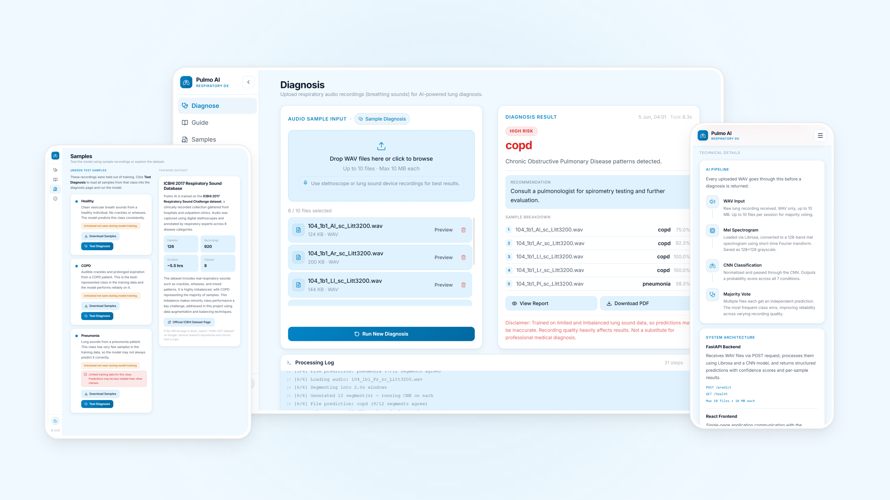

# Pulmo AI

A respiratory disease classification tool that analyzes lung audio recordings. WAV files are segmented into breath cycles, converted to mel spectrograms, and classified by a CNN model trained on the ICBHI 2017 dataset across eight conditions.

Live: https://pulmoai.pritamsardar.dev  |  Case Study: https://www.pritamsardar.dev/full-case-study/project-row-pulmo-ai?source=case-studies

<picture>
  <source media="(prefers-color-scheme: dark)" srcset=".github/images/pulmoai-hero-dark.png">
  
</picture>

## Features

* Upload up to ten WAV lung recordings per session with drag and drop support
* Preview audio files before running diagnosis
* Run AI diagnosis with per segment classification and majority voting
* Watch a real time processing log as each file is analyzed
* Get diagnosis results with severity level, clinical description, and recommendation
* Review per file confidence scores and full sample breakdown
* Download a formatted PDF report of the diagnosis
* Test instantly using built-in held-out sample recordings for healthy, COPD, and pneumonia
* Switch between light and dark mode with no flash on load

## Tech Stack

**Frontend:** React 19, Vite 8, Tailwind CSS v4

**PDF Export:** jsPDF

**Backend:** Python, FastAPI, uvicorn

**AI Model:** TensorFlow, Keras (3-block CNN)

**Audio Processing:** Librosa, Matplotlib, Pillow

**Model Utilities:** joblib, scikit-learn

**Deployment:** Vercel (client), Render (server)

## Getting Started

### Prerequisites

* Node.js 18 or higher
* Python 3.10 or higher

### Clone and install

```bash
git clone https://github.com/pritamsardar-dev/portfolio-respiratory-disease-diagnosis-ai-v1.git
cd portfolio-respiratory-disease-diagnosis-ai-v1
```

**Server setup:**

```bash
cd server
python -m venv venv
venv\Scripts\activate       # Windows
# source venv/bin/activate  # macOS or Linux
pip install -r requirements.txt
```

**Client setup:**

```bash
cd client
npm install
```

### Environment variables

Create a `.env` file inside the `client` directory:

```env
VITE_API_URL=http://localhost:8000
```

Update this to your deployed backend URL before building for production.

### Run locally

**Start the backend** from the `server` directory:

```bash
uvicorn main:app --reload
```

API runs at `http://localhost:8000`.

**Start the frontend** from the `client` directory:

```bash
npm run dev
```

App runs at `http://localhost:5173`.

## Project Structure

```
server/
├── models/          # Trained CNN model (.keras) and label encoder (.pkl)
├── utils/
│   ├── db.py        # SQLite job store with init, insert, fetch, save, delete, and purge operations
│   └── cleanup.py   # Temp file removal after each inference run
├── main.py          # FastAPI app with async job creation and job status and cancel endpoints
├── jobs.py          # Job lifecycle manager backed by SQLite with in-memory cancel event support
├── predictor.py     # Full inference pipeline with live progress callbacks and cancel event support
├── preprocess.py    # Data preprocessing and augmentation (training only, not deployed)
└── model_train.py   # CNN architecture and training script (training only, not deployed)

client/
├── public/
│   └── theme-init.js         # Applies saved theme before React mounts to prevent flash
├── src/
│   ├── assets/
│   │   └── samples/          # Held-out WAV recordings used for built-in sample testing
│   ├── components/
│   │   ├── app-shell/        # Layout wrapper connecting the sidebar and main content
│   │   ├── branding/         # Logo component
│   │   ├── layout/           # Mobile header and collapsible desktop sidebar
│   │   └── ui/               # Theme toggle
│   ├── pages/
│   │   ├── DiagnosePage.jsx  # Upload, inference, result display, and PDF export
│   │   ├── SamplesPage.jsx   # Built-in sample testing and dataset information
│   │   ├── GuidePage.jsx     # Step by step usage guide
│   │   ├── AboutPage.jsx     # Pipeline overview, architecture, and tech stack
│   │   └── Home.jsx          # App shell, page routing, and sidebar state management
│   └── utils/
│       └── theme.js          # Theme read and write helpers
```

## Technical Notes

### Async job system

Diagnosis runs as a background job on the server. When files are submitted, the backend creates a job with a unique ID and returns it immediately so the request never blocks. The frontend stores the job ID in localStorage and polls the status endpoint every second to receive live processing steps and the final result. Navigation away from the diagnosis page and back does not interrupt the run because the job continues on the server regardless of client state. Submitted files are persisted in IndexedDB and the processing log is persisted alongside them so both survive a page reload or navigation and are restored on remount. A cancel endpoint sets a threading event that stops inference between file boundaries, freeing CPU and memory without waiting for the full run to finish.

Job state is persisted to a SQLite database so active diagnoses survive server restarts. Any job that was still running when the server stopped is automatically marked as failed on the next startup so the client receives a clear error instead of polling indefinitely. Completed jobs are removed from the database as soon as the result is served. If the server restarts while the client is polling and the job is no longer found, the frontend stops polling and shows a recoverable error rather than looping on 404 responses.

### Segment based inference

The model was trained on individual breath cycle segments, not full recordings. To match this at inference time, each uploaded WAV is split into two second windows before classification. Every window becomes a mel spectrogram, passes through the CNN, and gets a label. A majority vote across all windows in a file gives the prediction for that file. If multiple files are uploaded, a second majority vote across all file predictions gives the final diagnosis. This two level voting makes results more stable when recording quality varies across segments.

### COPD class imbalance

The ICBHI 2017 dataset contains far more COPD recordings than any other class. Training on the raw data causes the model to predict COPD for almost everything. To address this, COPD was capped at 500 samples during preprocessing and all other classes were augmented using pitch shifting and time stretching until each reached 500 samples per split. Augmented samples were excluded from validation and test sets so evaluation always happens on real, unmodified recordings only.

### Theme flash prevention

The client includes a small inline script in `public/theme-init.js` that reads the saved theme from localStorage and applies the correct class to the document before React mounts. By the time the component tree renders, the right colors are already in place and no visual flash occurs.

## Future Ideas

* Real time lung audio recording directly in the browser
* Confidence score visualization broken down per class
* Support for additional respiratory conditions beyond the current eight
* Waveform and spectrogram display alongside diagnosis results
* Model retraining pipeline on newer or larger clinical datasets

## License

Licensed under the MIT License. See [LICENSE](./LICENSE) for details.

## Author

**Pritam Sardar**

GitHub: [github.com/pritamsardar-dev](https://github.com/pritamsardar-dev)

LinkedIn: [linkedin.com/in/pritam-sardar-dev](https://www.linkedin.com/in/pritam-sardar-dev/)

Portfolio: [pritamsardar.dev](https://pritamsardar.dev)

Email: [pritamsardar.dev@gmail.com](mailto:pritamsardar.dev@gmail.com)